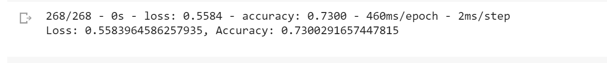
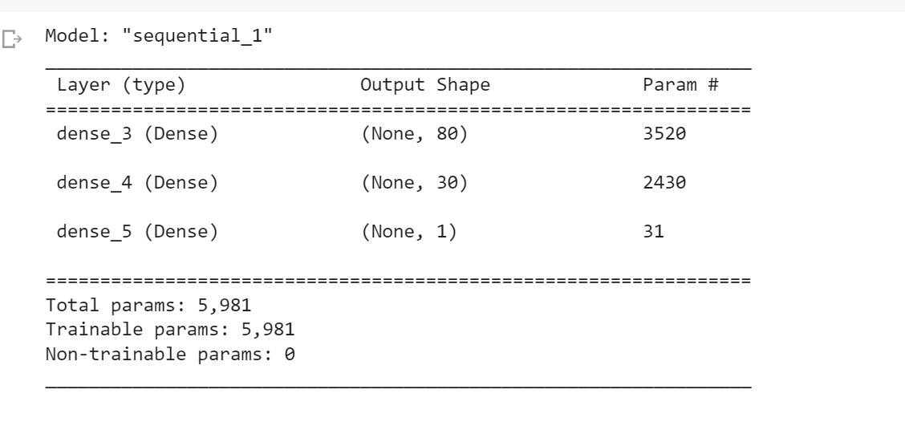
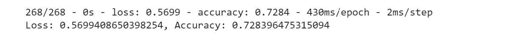
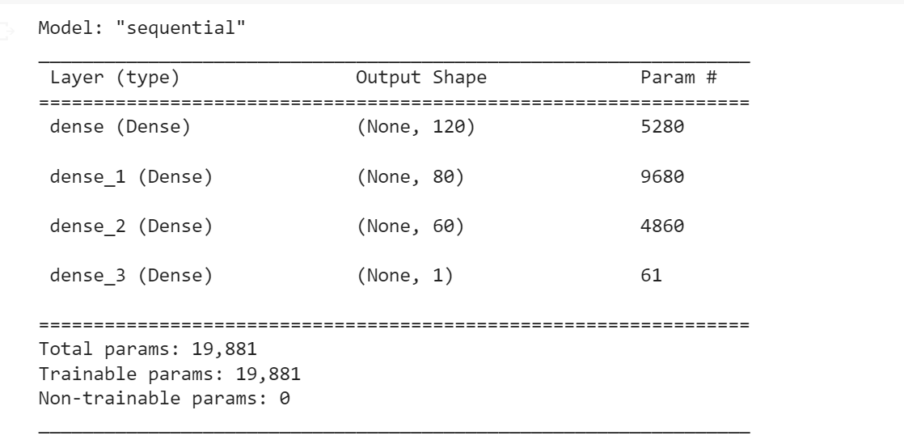
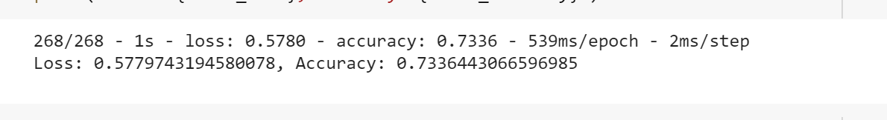

# Neural_Network_Charity_Analysis
Neural Networks and Deep Learning Models

# Overview 

In this project, I will be using machine learning and neural networks to create a binary classifier that predicts whether applicants will be successful if funded by Alphabet Soup.  The dataset is a CSV containing more than 34,000 organizations that have received funding from Alphabet Soup over the years. 

# Results:

- Data Preprocessing
    1. The target for the model is: IS_SUCCESSFUL.
    2. The features for the model are: APPLICATION_TYPE, AFFILIATION, CLASSIFICATION, USE_CASE, ORGANIZATION, STATUS, INCOME_AMT, SPECIAL_CONSIDERATION, ASK_AMT.
    3. Input data removed from the input were: EIN and NAME.
    
- Compiling, Training, and Evaluating the Model
    1. How many neurons, layers, and activation functions did you select for your neural network model, and why?
    
        - I had 2 layers and 113 neurons, (80 neurons in layer 1 and 30 neurons in layer 2). 
        - Sequential model was used because this is a binary classifier. I also used two activation functions: relu and sigmoid.
       
    2. Were you able to achieve the target model performance?
    
        - My model returned 73.0% accuracy, which was quite close to the target of 75%.     
    
    3. What steps did you take to try and increase model performance? 
    
        - To increase the performance, I increased the number of layers from 2 to 3.
        - Increased the total number of neurons from 113 to 260, (120,80,60 for layer 1,2,and 3 respectively), 
        - I changed the activation functions to a combination of tanh, relu, and sigmoid. 
        - The performance was 72.8%
        - I also ran it through an automated optimizer, the kerastuner, which search for best hyperparameters. 
        - The performance was 73.3%

method 1 (2 layers) performance: 73.0%

method 2 (3 layers) performance: 72.8%

method 3 (kerastuner) performance: 73.3%

# Summary: 

The performances of the above three methods were: 73.0%, 72.8%, and 73.3%. I was not able to achieve a performance above 75% accuracy.  However, another method I would recommend is RandomForest.  Structurally, it is similar to the neural network and is for tabular data, which is the dataset in this case.  
